# PROJECT_MAP

## 📅 Daily Progress
- `marine-traffic-monitor` moved to an AISStream-driven path: `ais_client.py` streams live vessel updates for the Hormuz bounding box, `run_api.py` snapshots counts into `data/hormuz_traffic_log.csv`, and `.github/workflows/marine-monitor-api.yml` runs the flow on a two-hour cadence in GitHub Actions.
- `daily-macro` kept shipping intraday improvements: `src/daily_macro/site.py` still acts as the schema-tolerant renderer for archived analysis JSON, while the scraper and analysis workflows now commit refreshed scrape/analysis artifacts without `[skip ci]`, keeping downstream automation and Pages deployment live.
- `daily-market` and `youtube-intake` both advanced their daily state: new `2026-04-10` market snapshots/summaries landed in `daily-market/data/*`, and YouTube intake refreshed archived channel/video analysis plus `state/channels.json`, preserving feed continuity for the next run.

## 🏗️ System Architecture

```mermaid
graph TD
    Docs["AGENTS.md / README.md / PROJECT_MAP.md"]
    Shared["models.py"]
    Workflows[".github/workflows/*.yml"]

    subgraph DM["daily-macro"]
        DMCLI["src/daily_macro/cli.py"]
        DMPipe["src/daily_macro/pipeline.py"]
        DMAnalysis["src/daily_macro/analysis.py"]
        DMSite["src/daily_macro/site.py"]
        DMNotify["src/daily_macro/notifier.py"]
        DMStore["src/daily_macro/storage.py"]
        DMDB["data/news.sqlite"]
        DMData["data/analyses/YYYY-MM-DD/hkej-news-analysis.json"]
        DMBackups["data/article_backups/YYYY/MM/DD/run_*/article-*.json"]
        DMSiteOut["site/index.html + site/archive + site/reports/*"]
    end

    subgraph MK["daily-market"]
        MKCLI["src/daily_market/cli.py"]
        MKPipe["src/daily_market/pipeline.py"]
        MKStorage["src/daily_market/storage.py"]
        MKDB["data/market.sqlite"]
        MKSnapshots["data/snapshots/YYYY-MM-DD/*.json"]
        MKSumm["data/summaries/YYYY-MM-DD/*.json"]
    end

    subgraph YT["youtube-intake"]
        YTCLI["src/youtube_intake/cli.py"]
        YTPipe["src/youtube_intake/pipeline.py"]
        YTAnalyst["src/youtube_intake/analyst.py"]
        YTClient["src/youtube_intake/youtube_client.py"]
        YTStorage["src/youtube_intake/storage.py"]
        YTRuntime["src/youtube_intake/runtime_env.py + preflight.py"]
        YTState["state/channels.json + state/analysis-retries.json"]
        YTArchive["data/youtube/<channel>/videos/*.json"]
        YTAnalysis["data/analysis/<run>/*.json"]
    end

    subgraph MTM["marine-traffic-monitor"]
        MTMRunner["run_api.py / run.py"]
        MTMAIS["ais_client.py"]
        MTMAnalyst["analyst.py"]
        MTMPolicy["policy_engine.py + state_manager.py"]
        MTMNews["news_fetcher.py"]
        MTMNotify["notifier.py"]
        MTMCSV["data/hormuz_traffic_log.csv"]
        MTMState["state/current_state.json + state/rate_counters.json"]
    end

    Docs --> DMCLI
    Docs --> MKCLI
    Docs --> YTCLI
    Docs --> MTMRunner
    Shared --> MTMAnalyst
    Workflows --> DMCLI
    Workflows --> MKCLI
    Workflows --> YTCLI
    Workflows --> MTMRunner
    Shared --> DMAnalysis

    DMCLI --> DMPipe
    DMCLI --> DMAnalysis
    DMCLI --> DMSite
    DMCLI --> DMNotify
    DMPipe --> DMStore
    DMStore --> DMDB
    DMPipe --> DMBackups
    DMAnalysis --> DMStore
    DMAnalysis --> DMNotify
    DMAnalysis --> DMData
    DMSite --> DMData
    DMSite --> DMSiteOut

    MKCLI --> MKPipe
    MKPipe --> MKStorage
    MKStorage --> MKDB
    MKStorage --> MKSnapshots
    MKStorage --> MKSumm

    YTCLI --> YTPipe
    YTCLI --> YTAnalyst
    YTCLI --> YTRuntime
    YTPipe --> YTClient
    YTPipe --> YTStorage
    YTPipe --> YTArchive
    YTAnalyst --> YTArchive
    YTAnalyst --> YTAnalysis
    YTAnalyst --> YTState
    YTStorage --> YTState

    MTMRunner --> MTMAIS
    MTMRunner --> MTMAnalyst
    MTMRunner --> MTMCSV
    MTMAnalyst --> MTMPolicy
    MTMAnalyst --> MTMNews
    MTMAnalyst --> MTMNotify
    MTMAnalyst --> MTMState
    MTMPolicy --> MTMState
    MTMPolicy --> MTMCSV
```

## 🧠 Context Memo
- `marine-traffic-monitor/run_api.py` now uses AISStream snapshots instead of the older browser/screenshot path for the scheduled GitHub Action. The point is operational reliability: a websocket feed is easier to run headlessly, cheaper than browser automation, and gives vessel manifests that can be logged directly into the traffic history CSV.
- The uncommitted follow-up in `marine-traffic-monitor/analyst.py` fixes the empty-image abstain payload so API-only runs can safely skip visual evidence without returning malformed fields. Paired with the `run_api.py` model swap to non-vision models, that keeps the consensus checker compatible with a screenshot-free execution mode instead of pretending a vision model saw evidence it never received.
- `daily-macro/src/daily_macro/site.py` remains deliberately defensive because report JSON evolves faster than the archive ages out. Sanitizing optional summary, diagnostics, subgroup, and model-switch fields prevents one older or partially generated analysis artifact from breaking the static site build.
- The workflow edits in `.github/workflows/daily-macro-scraper.yml` and `.github/workflows/daily-macro-analysis.yml` remove the previous CI-skip behavior so data commits still trigger the rest of the automation chain. That matters because the repo increasingly treats generated data as pipeline inputs, not just terminal artifacts.

## 🔗 Obsidian Links
- No new `.md` files were created in the last 24 hours.
- `PROJECT_MAP.md` remains the root note for repo memory; this refresh ties today's code changes in `marine-traffic-monitor/*.py`, `.github/workflows/marine-monitor-api.yml`, `daily-macro/src/daily_macro/site.py`, and the fresh `daily-market` / `youtube-intake` data artifacts back to one technical overview.
