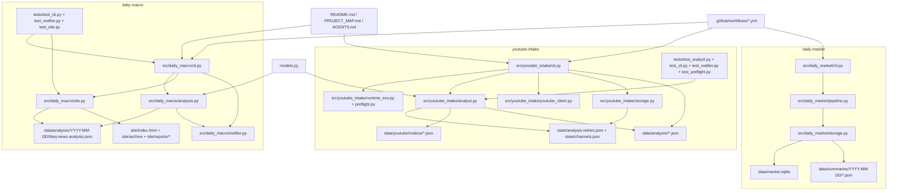

# PROJECT_MAP

## 📅 Daily Progress
- `daily-macro` grew from a report generator into a publishable static site flow: `build-site` now renders sanitized report archives via `src/daily_macro/site.py`, and `.github/workflows/daily-macro-pages.yml` deploys the output to GitHub Pages.
- `daily-macro` incremental reporting was tightened so intraday updates preserve prior executive summary context, mark newly analyzed articles, and keep the site renderer resilient to missing summary/diagnostic fields while the UI iterated on tabs, briefing placement, and diagnostics.
- `youtube-intake` added a replayable retry lane: `.github/workflows/youtube-intake-retry.yml` runs hourly, `analyst.py` persists delayed retries in `state/analysis-retries.json`, rotates across multiple Groq keys, and sends retry summaries after reprocessing due analyses.

## 🏗️ System Architecture

## 🧠 Context Memo
- `daily-macro/src/daily_macro/analysis.py` now carries `legacy_executive_summary` and `newly_analyzed_keys` through the graph so incremental reruns do not regenerate a full briefing from mixed old/new evidence. The intent is to make an intraday rerun read like an update, not a second morning note.
- `daily-macro/src/daily_macro/site.py` sanitizes both current and legacy summary fields before rendering because the report schema is moving while historical JSON remains in the archive. Keeping the renderer backward-compatible prevents one malformed or older report from breaking the published site build.
- The repeated fixes in `daily-macro/src/daily_macro/site.py` are mostly about renderer stability, not feature sprawl: missing locals, fallback bullets, and diagnostics guards were patched so GitHub Pages builds keep succeeding while the report UI keeps changing.
- `youtube-intake/src/youtube_intake/analyst.py` schedules retries on a delayed manifest instead of hard-failing transient Groq/API issues inline. That design keeps the main ingestion pass short, then lets a separate hourly workflow consume the backlog with fresh quota and a deterministic retry budget.
- Groq key rotation was added because a single exhausted or invalid key should not stall the full YouTube run. The retry manifest plus `read_env_list()` in `runtime_env.py` turns quota/auth fragility into controlled degradation instead of total pipeline failure.

## 🔗 Obsidian Links
- No new `.md` files were created in the last 24 hours.
- `PROJECT_MAP.md` remains the only root note updated today; it summarizes changes in `daily-macro/src/daily_macro/site.py`, `daily-macro/src/daily_macro/analysis.py`, `.github/workflows/daily-macro-pages.yml`, `.github/workflows/youtube-intake-retry.yml`, and the `youtube-intake/src/youtube_intake/*` retry stack.
