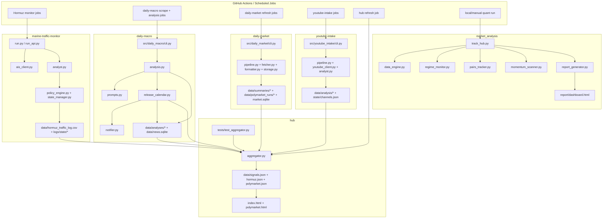

# PROJECT_MAP

## 📅 Daily Progress
- Added a new quant analysis lane: `market_analysis/` now provides `DataEngine`, `RegimeMonitor`, `PairsTracker`, `MomentumScanner`, and `ReportGenerator`, with [`track_hub.py`](/Users/henrywzh/Desktop/Quant/equity-research/track_hub.py) orchestrating the run into [`report/dashboard.html`](/Users/henrywzh/Desktop/Quant/equity-research/report/dashboard.html).
- Refactored and hardened macro release handling: [`daily-macro/src/daily_macro/prompts.py`](/Users/henrywzh/Desktop/Quant/equity-research/daily-macro/src/daily_macro/prompts.py) was split out of analysis code, and [`daily-macro/src/daily_macro/release_calendar.py`](/Users/henrywzh/Desktop/Quant/equity-research/daily-macro/src/daily_macro/release_calendar.py) now merges FRED releases with parsed Federal Reserve FOMC events.
- Tightened the hub’s data contract: [`hub/aggregator.py`](/Users/henrywzh/Desktop/Quant/equity-research/hub/aggregator.py) gained QQQ/BTC track-record and richer Polymarket history logic, while current local edits remove fallback mock FRED items and add coverage in [`hub/tests/test_aggregator.py`](/Users/henrywzh/Desktop/Quant/equity-research/hub/tests/test_aggregator.py).

## 🏗️ System Architecture

## 🧠 Context Memo
- The FOMC work in [`daily-macro/src/daily_macro/release_calendar.py`](/Users/henrywzh/Desktop/Quant/equity-research/daily-macro/src/daily_macro/release_calendar.py) exists because FRED release metadata is not enough for Fed meeting-day coverage. The code now scrapes the Federal Reserve calendar directly, then merges those events into the same digest so macro warnings can distinguish actual statement days from generic release IDs or stale press-release noise.
- The prompt split into [`daily-macro/src/daily_macro/prompts.py`](/Users/henrywzh/Desktop/Quant/equity-research/daily-macro/src/daily_macro/prompts.py) is architectural, not cosmetic. It separates long prompt templates from `analysis.py` so the analysis pipeline can keep evolving without burying business logic inside LLM strings.
- The new quant stack is intentionally isolated in `market_analysis/` and surfaced through [`track_hub.py`](/Users/henrywzh/Desktop/Quant/equity-research/track_hub.py). That keeps cross-sectional regime, pairs, and momentum logic reusable as a standalone dashboard pipeline instead of coupling it directly into the main hub before the signal contract is stable.
- The current local hub edits remove synthetic FRED fallback rows from [`hub/aggregator.py`](/Users/henrywzh/Desktop/Quant/equity-research/hub/aggregator.py) and add tests in [`hub/tests/test_aggregator.py`](/Users/henrywzh/Desktop/Quant/equity-research/hub/tests/test_aggregator.py). The point is to make missing API credentials visible as missing data, not silently replaced with fabricated calendar items that would pollute operational decisions.

## 🔗 Obsidian Links
- No new project `.md` files were created in the last 24 hours.
- Existing note surfaces still map as follows:
  [`README.md`](/Users/henrywzh/Desktop/Quant/equity-research/README.md) covers the repo entry points and operator workflow.
  [`daily-macro/README.md`](/Users/henrywzh/Desktop/Quant/equity-research/daily-macro/README.md) documents the `daily_macro` pipeline and its generated macro artifacts.
  [`daily-market/README.md`](/Users/henrywzh/Desktop/Quant/equity-research/daily-market/README.md) tracks the market snapshot and Polymarket ingestion path that now feeds the hub.
  [`youtube-intake/README.md`](/Users/henrywzh/Desktop/Quant/equity-research/youtube-intake/README.md) maps to the ingestion and analysis pipeline under `youtube-intake/src/youtube_intake/`.
  [`marine-traffic-monitor/PROJECT_README.md`](/Users/henrywzh/Desktop/Quant/equity-research/marine-traffic-monitor/PROJECT_README.md) maps to the Hormuz monitoring code and its CSV/state outputs.
