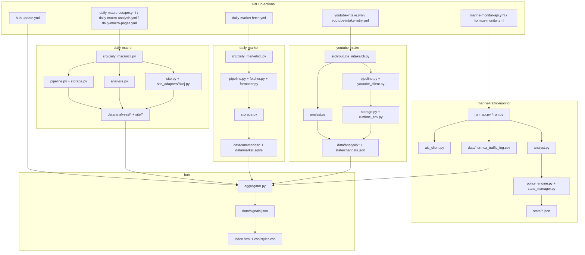

# PROJECT_MAP

## 📅 Daily Progress
- Added the `hub/` surface: `hub/aggregator.py` now pulls the latest outputs from `marine-traffic-monitor`, `daily-market`, `daily-macro`, and `youtube-intake` into `hub/data/signals.json`, while `hub/index.html` renders the combined command-center view.
- Hardened hub deployment after the initial landing: `hub/css/styles.css` made the page self-contained, and `.github/workflows/hub-update.yml` plus `hub/aggregator.py` were fixed to use repo-relative paths and a retrying push flow that survives concurrent bot commits.
- The rest of the repo kept feeding the new layer: Hormuz traffic logs, macro scrape and analysis artifacts, and YouTube channel state all refreshed today, and the repo-tracking restore commit brought the key Markdown docs back under version control.

## 🏗️ System Architecture

## 🧠 Context Memo
- `hub/aggregator.py` now resolves the repository root from `EQUITY_RESEARCH_ROOT` or the script location instead of a hard-coded laptop path. The reason is simple: the hub has to run both locally and inside GitHub Actions, and absolute workstation paths would make the workflow non-portable and silently stale.
- `.github/workflows/hub-update.yml` now commits with `set -euo pipefail`, pushes `HEAD:main`, and retries after `fetch`/`rebase`. That logic exists because the hub is downstream of several other automations, so race conditions are expected; the workflow needs to tolerate another bot landing a commit between checkout and push.
- The hub intentionally reads generated artifacts rather than importing the other packages directly. That keeps each pipeline independently runnable, treats JSON/CSV outputs as the contract boundary, and lets the dashboard aggregate data even when upstream code lives in separate CLI packages and schedules.

## 🔗 Obsidian Links
- `AGENTS.md`, `CLAUDE.md`, and `README.md` were restored to git tracking at the repo root. They act as operator notes for the code in `.github/workflows/`, `hub/`, and the pipeline directories.
- `daily-macro/README.md` maps to `daily-macro/src/daily_macro/*.py` and the generated `daily-macro/data/` plus `daily-macro/site/` outputs.
- `daily-market/README.md` maps to `daily-market/src/daily_market/*.py`, especially the fetch, format, storage, and watchlist flow that now feeds the hub market card.
- `marine-traffic-monitor/PROJECT_README.md` maps to `marine-traffic-monitor/run_api.py`, `ais_client.py`, `analyst.py`, and policy/state handling around the Hormuz log.
- `youtube-intake/README.md` maps to `youtube-intake/src/youtube_intake/*.py`, the run summaries in `youtube-intake/data/analysis/`, and the state tracked in `youtube-intake/state/channels.json`.
