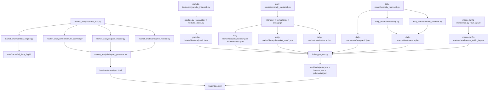

# PROJECT_MAP

## 📅 Daily Progress
- Integrated the quant dashboard into the hub flow: [`market_analysis/track_hub.py`](/Users/henrywzh/Desktop/Quant/equity-research/market_analysis/track_hub.py) now orchestrates regime, pairs, and momentum analysis into [`hub/market-analysis.html`](/Users/henrywzh/Desktop/Quant/equity-research/hub/market-analysis.html), while [`hub/index.html`](/Users/henrywzh/Desktop/Quant/equity-research/hub/index.html) links that page from the Market Momentum card.
- Hardened macro event coverage: [`daily-macro/src/daily_macro/release_calendar.py`](/Users/henrywzh/Desktop/Quant/equity-research/daily-macro/src/daily_macro/release_calendar.py) merges FRED releases with scraped FOMC calendar events, and [`daily-macro/src/daily_macro/nowcasting.py`](/Users/henrywzh/Desktop/Quant/equity-research/daily-macro/src/daily_macro/nowcasting.py) expands Cleveland Fed nowcasts plus GDPNow into `macro.sqlite`.
- Refreshed the live data surfaces that feed the hub: `daily-market` added new `polymarket_runs` plus snapshot summaries, `marine-traffic-monitor` refreshed the Hormuz traffic log, `youtube-intake` added Goldman Sachs analysis artifacts, and [`hub/aggregator.py`](/Users/henrywzh/Desktop/Quant/equity-research/hub/aggregator.py) continued publishing [`hub/data/signals.json`](/Users/henrywzh/Desktop/Quant/equity-research/hub/data/signals.json), [`hub/data/hormuz.json`](/Users/henrywzh/Desktop/Quant/equity-research/hub/data/hormuz.json), and [`hub/data/polymarket.json`](/Users/henrywzh/Desktop/Quant/equity-research/hub/data/polymarket.json).

## 🏗️ System Architecture

## 🧠 Context Memo
- The FOMC merge in [`daily-macro/src/daily_macro/release_calendar.py`](/Users/henrywzh/Desktop/Quant/equity-research/daily-macro/src/daily_macro/release_calendar.py) exists because FRED release metadata alone misses Fed meeting structure. Pulling the Federal Reserve calendar into the same digest keeps warning logic aligned with actual statement days instead of treating macro risk as a pure release-ID problem.
- The nowcast expansion in [`daily-macro/src/daily_macro/nowcasting.py`](/Users/henrywzh/Desktop/Quant/equity-research/daily-macro/src/daily_macro/nowcasting.py) is about making `macro.sqlite` a reusable store, not a one-off fetch. Cleveland Fed month/quarter/year variants and GDPNow are normalized into the same schema so the hub and future macro tooling can read one table instead of scraping multiple sites on demand.
- [`market_analysis/track_hub.py`](/Users/henrywzh/Desktop/Quant/equity-research/market_analysis/track_hub.py) pre-fetches the full ticker universe before running regime, pairs, and momentum modules so all three layers operate on the same cached price window. That avoids inconsistent calculations where one module sees fresher bars or a partial download and another does not.
- The hub integration is intentionally loose-coupled: [`hub/aggregator.py`](/Users/henrywzh/Desktop/Quant/equity-research/hub/aggregator.py) still publishes compact JSON payloads for the command-center view, while the quant lane renders a separate HTML page. That keeps the new analysis stack shippable without forcing the main hub to absorb heavy charting logic or a larger client-side data contract yet.

## 🔗 Obsidian Links
- No new `.md` files were created in the last 24 hours.
