# PROJECT_MAP

## 📅 Daily Progress
- `daily-macro` added fuzzy article-result reconciliation plus `daily_stats` coverage reporting, then simplified notifier subgroup rendering so single-subgroup categories no longer duplicate summary text.
- `youtube-intake` hardened runtime config loading by auto-discovering Netscape cookie files under `config/`, supporting comma-separated Groq key rotation, and preserving RSS-based discovery with better transcript fallback handling.
- Repo orchestration was cleaned up around the active pipelines: `daily-market` produced fresh morning/evening artifacts, CI for `daily-macro` was adjusted, and the obsolete `truthsocial-monitor` workflow/subproject was removed.

## 🏗️ System Architecture

```mermaid
graph TD
    Docs[README.md / PROJECT_MAP.md / AGENTS.md]
    Workflows[.github/workflows/*.yml]
    Shared[models.py]

    subgraph DM[daily-macro]
        DMCLI[cli.py]
        DMPipe[pipeline.py]
        DMAnalysis[analysis.py]
        DMNotify[notifier.py]
        DMStorage[storage.py]
        DMAdapter[site_adapters/hkej.py]
        DMDB[data/news.sqlite]
        DMReports[data/analyses/YYYY-MM-DD/*.json]
        DMBackups[data/article_backups/YYYY/MM/DD/run_*/]
        DMTests[tests/test_analysis.py + test_notifier.py]
    end

    subgraph DMarket[daily-market]
        MKCLI[cli.py]
        MKPipe[pipeline.py]
        MKFetch[fetcher.py]
        MKFmt[formatter.py]
        MKNotify[notifier.py]
        MKStorage[storage.py]
        MKWatch[config/watchlist.json]
        MKDB[data/market.sqlite]
        MKSnaps[data/snapshots/YYYY-MM-DD/*.json]
        MKSumm[data/summaries/YYYY-MM-DD/*.json]
    end

    subgraph YT[youtube-intake]
        YTCLI[cli.py]
        YTPre[preflight.py]
        YTPipe[pipeline.py]
        YTClient[youtube_client.py]
        YTRuntime[runtime_env.py]
        YTAnalyst[analyst.py]
        YTNotify[notifier.py]
        YTStorage[storage.py]
        YTConfig[config/channels.json]
        YTState[state/channels.json]
        YTArchive[data/youtube/<channel>/videos/*.json]
        YTAnalysis[data/analysis/<run>/*.json]
    end

    Workflows --> DMCLI
    Workflows --> MKCLI
    Workflows --> YTCLI
    Docs --> DMCLI
    Docs --> MKCLI
    Docs --> YTCLI
    Shared --> DMAnalysis
    Shared --> YTAnalyst

    DMCLI --> DMPipe
    DMCLI --> DMAnalysis
    DMCLI --> DMNotify
    DMPipe --> DMAdapter
    DMPipe --> DMStorage
    DMStorage --> DMDB
    DMPipe --> DMBackups
    DMAnalysis --> DMStorage
    DMAnalysis --> DMReports
    DMAnalysis --> DMNotify
    DMTests --> DMAnalysis
    DMTests --> DMNotify

    MKCLI --> MKPipe
    MKPipe --> MKWatch
    MKPipe --> MKFetch
    MKPipe --> MKFmt
    MKPipe --> MKStorage
    MKPipe --> MKNotify
    MKStorage --> MKDB
    MKStorage --> MKSnaps
    MKStorage --> MKSumm

    YTCLI --> YTPre
    YTCLI --> YTPipe
    YTCLI --> YTAnalyst
    YTCLI --> YTNotify
    YTPipe --> YTRuntime
    YTPipe --> YTClient
    YTPipe --> YTStorage
    YTStorage --> YTConfig
    YTStorage --> YTState
    YTStorage --> YTArchive
    YTAnalyst --> YTArchive
    YTAnalyst --> YTAnalysis
    YTNotify --> YTAnalysis
```

## 🧠 Context Memo
- The fuzzy match fallback in `daily-macro/src/daily_macro/analysis.py` exists because the LLM can slightly rewrite canonical URLs in batched responses. Matching by `source_article_id` as a second pass prevents valid article analyses from being discarded as "missing" just because the URL text drifted.
- The new `daily_stats` block is there to measure pipeline coverage, not just output volume. The notifier now surfaces `analyzed / scraped` so partial scrape-to-analysis gaps are visible immediately instead of being hidden behind a polished summary email.
- The subgroup rendering changes in `daily-macro/src/daily_macro/notifier.py` deliberately remove repeated headers and rationale blocks when a category only has one subgroup. That keeps Gmail output readable while still preserving richer subgroup structure when multiple thematic clusters genuinely exist.
- `youtube-intake` now looks for standalone Netscape cookie exports under `youtube-intake/config/` and rotates across comma-separated Groq keys because the fragile part of that pipeline is access continuity: transcript fallback only works if cookies stay usable and STT quota does not dead-end on a single key.
- Removing `truthsocial-monitor` from both `.github/workflows/` and the repo root reduces operational noise. The active automation surface is now the macro, market, YouTube, and marine-traffic pipelines that still have live code paths.

## 🔗 Obsidian Links
- `AGENTS.md`: new repo-operations note added at the root; it relates to coding work by documenting the Git/worktree constraint that can break Codex/Antigravity metadata resolution if `.git/config` enables `extensions.worktreeConfig`.
- No other new `.md` files were created in the last 24 hours, so there are no additional Obsidian note-to-code links to wire up today.
