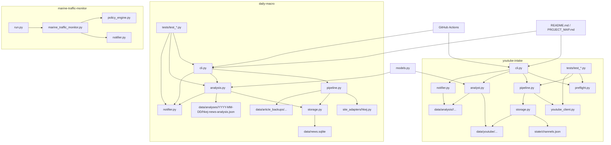

# PROJECT_MAP

## 📅 Daily Progress
- `daily-macro` analysis was refactored into a LangGraph pipeline (`initialize -> route_attention -> analyze_today -> retry_previous_day -> finalize`) with incremental reuse of prior successful article analyses and selective previous-day retries.
- `daily-macro` reporting was upgraded with attention tiers, thematic subgroups, richer Gmail rendering, and a `local-test` CLI path to exercise scrape -> analyze -> notify locally.
- `youtube-intake` GitHub Actions flow was hardened by adding `preflight`, switching discovery to RSS-backed candidate listing, normalizing Gmail env usage, and surfacing transcript fallback diagnostics into run artifacts.

## 🏗️ System Architecture

## 🧠 Context Memo
- The new `daily-macro` graph exists to make analysis incremental instead of reprocessing whole days. Successful article analyses are reused, only unresolved or newly arrived articles are sent back through Groq, and the previous day can be retried opportunistically when partial failures remain.
- Attention routing was added because not every article deserves the same token budget. Heuristics seed `high|medium|light` priorities, then an LLM router can refine larger categories so market-moving stories stay intact while lighter sections get smaller budgets and coarser synthesis.
- The subgroup layer and richer notifier output exist to make the saved JSON and Gmail summaries more usable as research artifacts. Category blobs were becoming too broad; thematic subgrouping preserves narrative clusters and exposes article-level priority markers.
- `youtube-intake` preflight and RSS discovery were added to reduce GitHub Actions fragility. RSS avoids the older tab-scrape failure mode, preflight fails early when secrets are missing, and run notes now explain when transcript fallback was skipped because cookies were unavailable.

## 🔗 Obsidian Links
- No new `.md` files were created in the last 24 hours.
- Today’s new artifacts were JSON/state/workflow changes rather than note files, so there are no new Obsidian note links to wire back to code yet.
